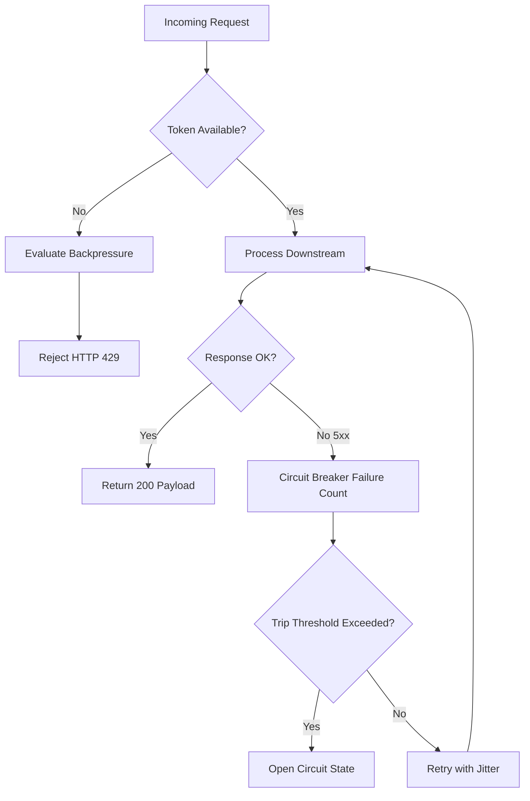

# The Architecture of Resilient Systems

> A field guide to building fault-tolerant, high-throughput software architectures with minimal operational complexity.

Written by **Elena Rostova** · Published September 2026 · *12 min read*

---

## Executive Summary

Modern distributed architectures often collapse not from external traffic surges, but from internal coordination deadlocks, hidden feedback loops, and cascading timeouts. By paring down architectural layers and prioritizing bounded autonomy, engineering teams can achieve resilience that survives unpredictable network partitions.

> [!IMPORTANT]
> The single greatest predictor of outage duration is not code complexity, but the opacity of state transitions during failure recovery.

---

## Core Principles

Every resilient system adheres to four invariants:

1. **Explicit Degradation Paths**: Every downstream dependency must have an offline cache, a stale fallback, or an immediate graceful error.
2. **Backpressure Propagation**: Upstream callers must receive pushback before internal buffers saturate.
3. **Idempotent Ingestion**: Network retries should never duplicate mutation side effects.
4. **Observable Invariants**: Health cannot be inferred from HTTP 200 counts alone.

### Invariant Comparison Matrix

| Principle                    | Failure Mode Mitigated       | Latency Impact    | Implementation Complexity |
| :--------------------------- | :--------------------------- | :---------------- | :------------------------ |
| Circuit Breakers             | Cascading thread starvation  | Negligible (<1ms) | Moderate                  |
| Rate Limiters (Token Bucket) | Resource exhaustion          | < 2ms overhead    | Low                       |
| Outbox Pattern               | Distributed dual-write drift | Eventual (Async)  | Moderate                  |
| Lease Coordination           | Split-brain split authority  | Dependent on TTL  | High                      |

---

## Architectural Alerts & Guidance

> [!NOTE]
> All services within the internal mesh communicate using compact protocol buffers over HTTP/2, with automated mutual TLS renewal handled at the transport boundary.

> [!TIP]
> Prefer local in-memory token buckets for first-line rejection before invoking Redis or distributed coordination layers.

> [!WARNING]
> Setting socket timeouts higher than the upstream gateway timeout will inevitably lead to phantom request queues.

> [!CAUTION]
> Never execute database schema migrations with exclusive table locks while peak traffic exceeds 40% of standard capacity.

---

## Implementation Patterns

### 1. Zero-Allocation Token Bucket (Rust)

Below is an implementation of a lock-free token bucket limiter in Rust:

```rust
use std::sync::atomic::{AtomicU64, Ordering};
use std::time::{Duration, Instant};

pub struct AtomicRateLimiter {
    capacity: u64,
    refill_rate_per_sec: u64,
    tokens: AtomicU64,
    last_update: Instant,
}

impl AtomicRateLimiter {
    pub fn new(capacity: u64, refill_rate_per_sec: u64) -> Self {
        Self {
            capacity,
            refill_rate_per_sec,
            tokens: AtomicU64::new(capacity),
            last_update: Instant::now(),
        }
    }

    pub fn try_acquire(&self, requested: u64) -> bool {
        let mut current = self.tokens.load(Ordering::Relaxed);
        loop {
            if current < requested {
                return false;
            }
            let next = current - requested;
            match self.tokens.compare_exchange_weak(
                current,
                next,
                Ordering::SeqCst,
                Ordering::Relaxed,
            ) {
                Ok(_) => return true,
                Err(actual) => current = actual,
            }
        }
    }
}
```

### 2. Resilient Fetch Pipeline (TypeScript)

Here is the corresponding client middleware handling automatic backoff with jitter:

```typescript
interface RetryOptions {
  maxRetries: number;
  baseDelayMs: number;
  maxDelayMs: number;
}

export async function resilientFetch(
  url: string,
  options: RequestInit,
  config: RetryOptions = { maxRetries: 3, baseDelayMs: 200, maxDelayMs: 4000 }
): Promise<Response> {
  let attempt = 0;

  while (true) {
    try {
      const response = await fetch(url, options);
      if (response.ok || (response.status < 500 && response.status !== 429)) {
        return response;
      }
      throw new Error(`HTTP ${response.status}: ${response.statusText}`);
    } catch (err) {
      attempt++;
      if (attempt > config.maxRetries) {
        throw err;
      }
      // Calculate exponential backoff with full jitter
      const expDelay = config.baseDelayMs * Math.pow(2, attempt);
      const delay = Math.min(config.maxDelayMs, Math.random() * expDelay);
      await new Promise(resolve => setTimeout(resolve, delay));
    }
  }
}
```

---

## Failure Recovery Flowchart



---

## Mathematical Formulation

The token refill model follows an affine linear equation bounded by bucket capacity $C$:

$$
T(t) = \min\left(C, \; T(t_0) + \rho \cdot (t - t_0)\right)
$$

Where:

- $T(t)$ represents available tokens at time $t$
- $\rho$ represents the sustained refill rate in tokens per second
- $C$ represents the burst tolerance limit

For tail latency distribution, the 99.9th percentile bound under Pareto-distributed workloads obeys:

$$
\mathbb{P}(X > x) = \left(\frac{x_m}{x}\right)^\alpha \quad \text{for } x \ge x_m
$$

---

## Deployment Checklist

- [x] Configure health probe intervals with at least 3 consecutive failures before node unregistration
- [x] Provision distributed tracing propagation headers (`traceparent`, `tracestate`)
- [ ] Verify circuit breaker trip thresholds in staging load tests
- [ ] Confirm database connection pool sizes match available backend worker threads
- [ ] Configure edge CDN stale-while-revalidate caches
